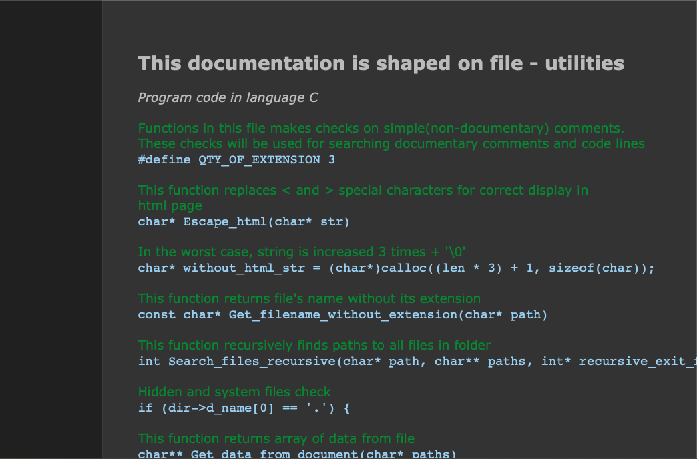

# documentary (Alpha 1.0)

# The Repository
This repository is a course project of discipline named "Software Development Technologies", during the development, we improved our skills of team-working using git, CI, code-style and unit-testing.
# Documentary
This program compiles documentation in html page format based on comments in source code. Here you can see  [supported programming languages](https://github.com/morozov312/documentary/wiki)
# How it works?

1)Installation  
  $ git clone https://github.com/morozov312/documentary.git && cd documentary && make install  
2)Running:  
  Running from local git repository: make run(default src and out dir) 
  Running from anywhere: documentary <args>  
  You can use "documentary --help" for details  
  Use "documentary -inpdir --help" or "documentary -outdir --help" for more information about arguments  

<b>!important</b> 
<i>1) Don't use more than 30 file in a folder and don't try to process files which larger than 
50 000 lines or witch length of lines exceeds 500 characters.  
In this case, everything that is not included in the working range of the program will not be processed.  
2) For more correct display of documentation you can apply code style,such as Clang-format, to your document, but this is optional.</i>
<h1>Project build</h1>

This project uses Makefile to build. Command's which you can use:  
$ make  
Builds this project into executable files which will be located in bin folder  
$ make install  
Builds this project into executable files and replaces them to root folder  
$ make uninstall  
Deletes all installed files from root  
$ make reinstall  
Reinstall all installed files  
$ make run  
Runs program to generate documentation on this project surce files  
$ make check  
Tests existing functions using the library ctest.h  
$ make clean  
Removes assembly artifacts in folders ./bin and ./build and all html pages which you created in the folder ./docs  
$ make clean_html  
Removes generated html files in folder ./docs  
Compiler: gcc   OS you can use is Linux 

<h1>Example</h1>
Example of work and finished documentation developed by this program you can find in folder ./example    

  

